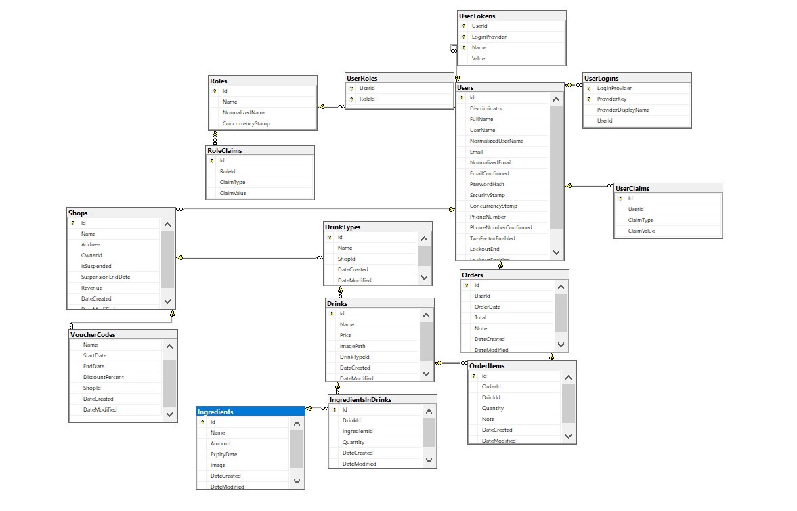

<h1 align="center">☕ Coffee Management app using Vite React & .NET 6 WebApi🖥️📝</h1>

- JWT Authentication Flow for User Login, Register, Logout
- Project Structure for React Redux JWT Authentication, Router, Axios
- Working with Redux Actions, Reducers, Store using redux-toolkit
- Creating React Function Components with Hooks & Form Validation
- React Function Components for accessing protected Resources (Authorization)
- Dynamic Navigation Bar in React App

## Techs involed
[](https://skillicons.dev)

# API (Server) ⚙️
## Endpoints
<!--  -->

## Database Diagram


# React SPA (Client)


### Note:
Open `src/services/auth-header.js` and modify `return` statement for appropriate back-end (found in the tutorial).

```js
export default function authHeader() {
  const user = JSON.parse(localStorage.getItem('user'));

  if (user && user.accessToken) {
    // return { Authorization: 'Bearer ' + user.accessToken }; // for Spring Boot back-end
    return { 'x-access-token': user.accessToken };             // for Node.js Express back-end
  } else {
    return {};
  }
}
```


### Compiles and hot-reloads client_side for development
In the project directory, you can run:

```
npm run dev
# or
yarn run dev
```

Open [http://localhost:5173](http://localhost:5173) to view it in the browser.

The page will reload if you make edits.

## 🤝 Collaborators

We thank the following people who contributed to this project:

<table>
  <tr>
    <td align="center">
      <a href="https://github.com/entykey">
        <br>
        <sub>
          <b>Nguyễn Hữu Anh Tuấn</b>
        </sub>
      </a>
    </td>
  </tr>
</table>

### Preferences
